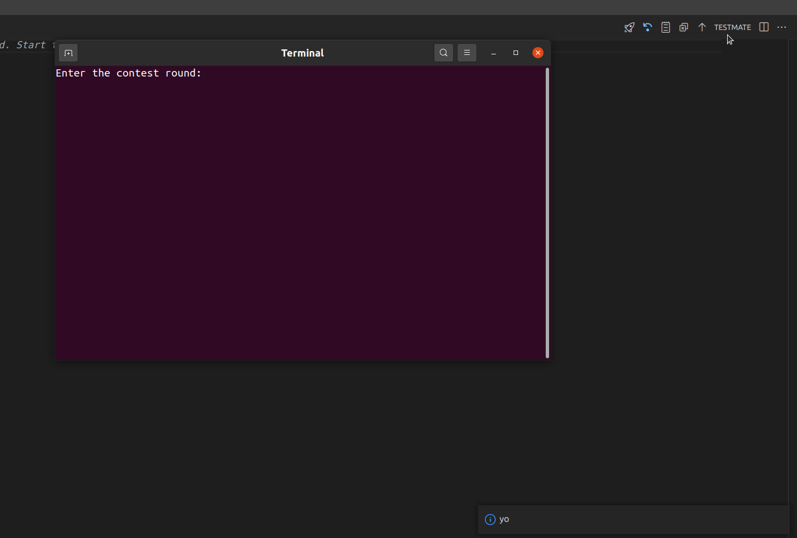

# TestMate README

This extension is made using javascript

<!-- This is the README for your extension "tm-vscode". After writing up a brief description, we recommend including the following sections. -->

This application is to assist a competitive-programmer in a CodeForces round.

The application downloads all the sample test cases for a problem and runs a user's solution program on all
these test cases so that **__no time is wasted__** on manual checking of the solution.

## Features

(Currently working on Ubuntu 20.04 LTS)

Features a custom command where user can input the contest round number. The program parses the sample testcases.

The extension includes buttons to run the program with sample input & to check the solution program's output to the expected output. Also to do batch test. Batch test outputs the verdict if all outputs are same as expected.

<!-- Describe specific features of your extension including screenshots of your extension in action. Image paths are relative to this README file. -->

For example if there is an image subfolder under your extension project workspace:

1. Enter the round to download all sample test cases :--

2. Batch Test and verdict :--

<!-- \!\[feature X\]\(images/feature-x.png\) -->

<!-- > Tip: Many popular extensions utilize animations. This is an excellent way to show off your extension! We recommend short, focused animations that are easy to follow. -->

## Requirements

1. Linux (Tested on Ubuntu 20.04 LTS)
2. working g++
   * To check g++ is working
      * Open a terminal window
      * Run "g++"
       If it identifies the command, it is working.
3. Python3
4. Visual Studio Code (v>=1.63.0)

<!-- If you have any requirements or dependencies, add a section describing those and how to install and configure them. -->

<!-- ## Extension Settings

Include if your extension adds any VS Code settings through the `contributes.configuration` extension point.

For example:

This extension contributes the following settings:

* `myExtension.enable`: enable/disable this extension
* `myExtension.thing`: set to `blah` to do something -->

## Known Issues

Currently working only for c++ solution files.

Making another repo for windows users 

<!-- Calling out known issues can help limit users opening duplicate issues against your extension. -->

## Release Notes

Users appreciate release notes as you update your extension.

### 1.0.0

Initial release of TestMate

<!-- ### 1.0.1

Fixed issue #.

### 1.1.0

Added features X, Y, and Z. -->

-----------------------------------------------------------------------------------------------------------
<!-- 
## Working with Markdown

**Note:** You can author your README using Visual Studio Code.  Here are some useful editor keyboard shortcuts:

* Split the editor (`Cmd+\` on macOS or `Ctrl+\` on Windows and Linux)
* Toggle preview (`Shift+CMD+V` on macOS or `Shift+Ctrl+V` on Windows and Linux)
* Press `Ctrl+Space` (Windows, Linux) or `Cmd+Space` (macOS) to see a list of Markdown snippets

### For more information

* [Visual Studio Code's Markdown Support](http://code.visualstudio.com/docs/languages/markdown)
* [Markdown Syntax Reference](https://help.github.com/articles/markdown-basics/)

**Enjoy!** -->
